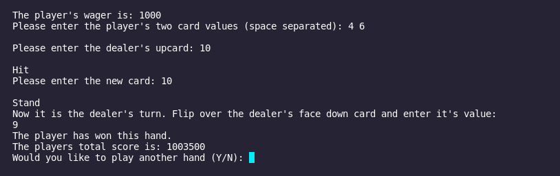

Portfolio
=========

Programming Projects
--------------------

*For access to my private project repositories, please [email me](mailto:example@csustudent.net?subject=GitHub%20Access) with the subject line, GitHub Access.

---
### [Hang Man | CSCI 235](project1)

---
### [Blackjack Game and Simulater | CSCI 325](project2)

---
### [HTML Parser | CSCI 315](project3)

---
### [Right Triangle Calculator | CSCI 301](project4)

---

Ethics Papers
-------------

### [CSCI 301 Ethics Paper](/pdf/CSCI301Ethics.pdf)

-   **Class: CSCI 301**  
-   **Grade: A**

### [Responsibility of the Creator](/pdf/CSCI315Ethic.pdf)

-   **Class: CSCI 315** 
-   **Grade: A**

### [Morals in the Workplace](/pdf/CSCI332Ethics.pdf)

-   **Class: CSCI 332** 
-   **Grade: A**

---

Presentations
-------------

### [Equifax Breach](/images/EquifaxBreachPres.mp4)

- **Class: CSCI 301** 
- **Grade: A**

### [Presentation 2 Title](/pdf/sample_presentation.pdf)

- **Class:** 
- **Grade:**

---

Page template forked from <a href="https://github.com/csu-cs/csci-portfolio">CSU-CS</a>

<!-- Remove above link if you don't want to attributive -->
