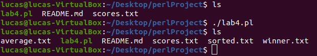
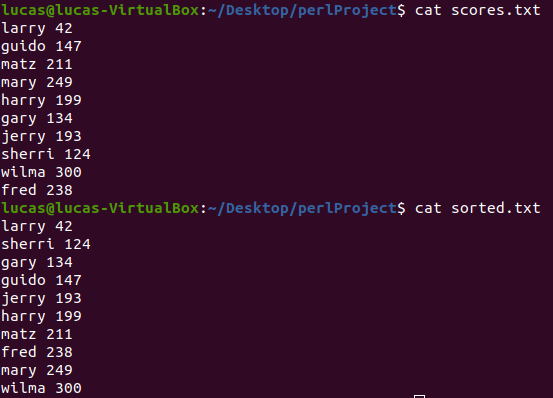
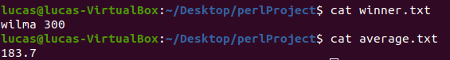

[Back to Portfolio](./)

Perl hash Table 
===============

-   **Class: CSCI 301** 
-   **Grade: A**
-   **Language(s): Perl**
-   **Source Code Repository:** [neidlinger/perlProject](https://guides.github.com/neidlinger/perlProject/)  
    (Please [email me](mailto:lgneidlinger@csustudent.net?subject=GitHub%20Access) to request access.)

## Project description

This was an exercise to expand and test knowledge of read/write abilities to external files in Perl as well as reading those values into a hash table. 

## How to compiles / run the program

Navigate to the correct directory and compile and run using this command:

```bash
./lab04.pl
```

## Design

This project used a hash table in Perl to store input from a given .txt file. Then the program sorted the inputted scores and printed the results to a new .txt file. From there the program took the highest score and calculated the average of all the scores and entered those values into a new .txt file for each. Figure 1 shows what happens when you run the program. It creates three .txt files with the sorted list(Figure 3), highest score, and average score (Figure 2).


Fig 1. Showing creation of text files.


Fig 2. Showing the input text and the sorted output.



Fig 3. Showing the highest score and the calculated average.

[Back to Portfolio](./)