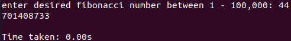
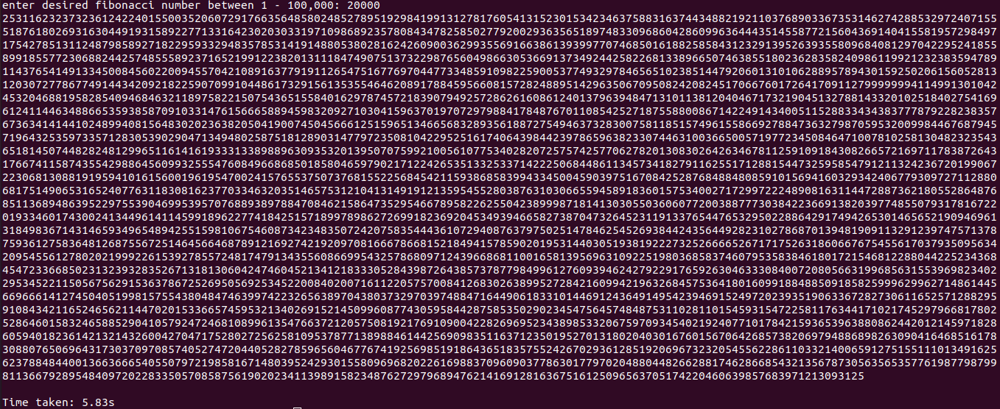
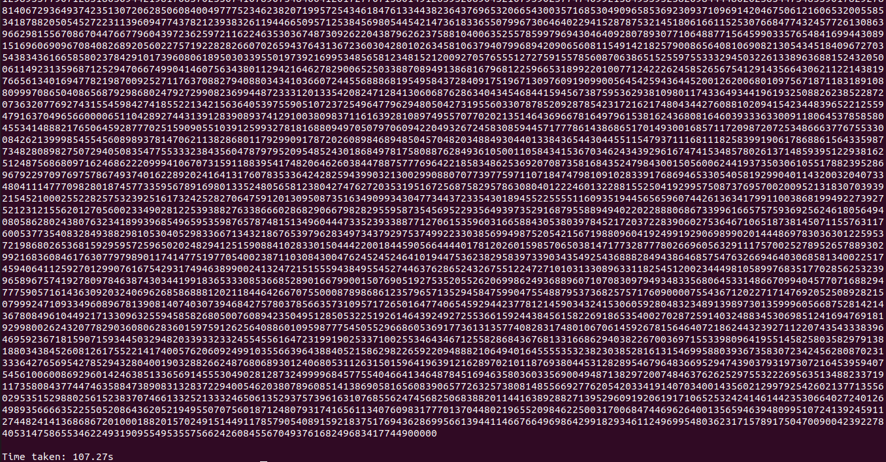

[Back to Portfolio](./)

Large Fibonacci Calculator
===============

-   **Class: CSCI 415** 
-   **Grade: A**
-   **Language(s): C++**
-   **Source Code Repository:** [neidlinger/fibonacci](https://guides.github.com/neidlinger/fibonacci/)  
    (Please [email me](mailto:lgneidlinger@csustudent.net?subject=GitHub%20Access) to request access.)

## Project description

This program takes in a number between 1-100,000 and calulates the fibonacci number at that position while also clocking how long it took. This program is able to calulate such high values as it is summing  each position as you would by hand.

## How to compiles / run the program

Navigate to the correct directory and compile and run using this command:

```bash
./fib
```

## Design

This project asks the user for a number between 1 and 100,000 and from there it calculates the fibonacci number at that position along with how long it took to calculate. The program is able to add such large numbers because it adds the two numbers as you would on a sheet of paper. It goes place by place and adds the two numbers, if there is a remainder then that gets added to the next position. With this there is no boundry to number size, just computing limitations. Though, with enough time it can calculate any value given within range. Figure 4 shows the output of 75,000 being given. While it would take many screenshots to include the whole answer the time shows just how taxing the large addition can be. 


Fig 1. showing initial ask of user.


Fig 2. Example if 44 is given for the value.


Fig 3. Example if 20,000 is given for the value.


Fig 4. Example if 75,000 is given for the value.

[Back to Portfolio](./)