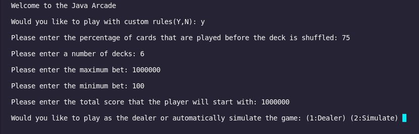
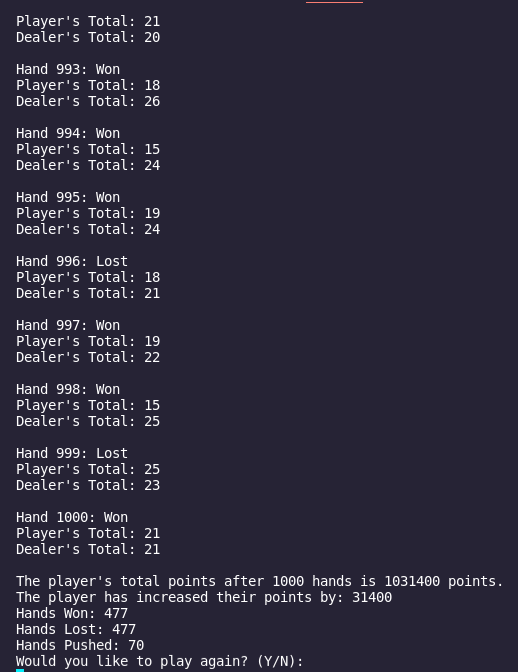

[Back to Portfolio](./)

Blackjack Game and Simulater
===============

-   **Class: CSCI 325** 
-   **Grade: A**
-   **Language(s): Java**
-   **Source Code Repository:** [neidlinger/cardGame](https://github.com/neidlinger/cardGame/tree/SPR)  
    (Please [email me](mailto:lgneidlinger@csustudent.net?subject=GitHub%20Access) to request access.)

## Project description

This was a large group project that involved four people, myself, Cody Cain, Justin Kizer, and Steven Colo. The program can play the game Blackjack, where it plays as many hands as the user inputs. It can take custom rules or preset rules depending on user's desires. The program uses card counting to determine what actions to take on any given hand. The program simulates the number of hands requested and outputs the results of the games played.

## How to compiles / run the program

Run the class files in JVM and then use Apache NetBeans IDE to compile and run. 

## Design

 It starts by asking the user if they would like to play with custom rules or not. If no is chosen, then it will just ask how many hands to run and the players starting money. If yes is chosen then it will ask shuffle percentage, decks used, and min/max bets (Fig. 1). It will take the players starting money and simulate the number of hands requested. If at any point the player runs out of money the simulation will end (Fig.2). After it has ran the hands, it outputs the number of hands ran, updated money, difference between starting and ending money, number of hands won, number of hands lost, and number of hands pushed. After that it asks if you would like to play again with the option to select yes or no. The determining factor on what the player should do is calculating using card counting. It breaks down what the dealer has had as well as the player and subtracts it from the current number of decks. Depending on the card it will increase or decrease the count and depending on the count it will tell them whether they are in a good position or not. There is also an option to play the game as the dealer yourself where the user inputs the cards that are given to the player and dealer for each hand and the program plays the game with the given values (Fig. 4). 

Fig 1. Custom rules selection

Fig 2. Example of player running out of money.

Fig 3. Example of player not running out of money.

Fig 4. Manual entry of cards.

## 3. Additional Considerations

This program does assume the user knows how to play Blackjack.

[Back to Portfolio](./)