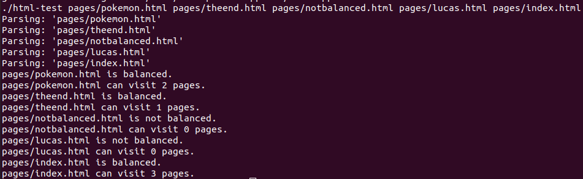

[Back to Portfolio](./)

HTML Parser
===============

-   **Class: CSCI 315** 
-   **Grade: A**
-   **Language(s): C++**
-   **Source Code Repository:** [neidlinger/htmlParser](https://guides.github.com/neidlinger/htmlParser/)  
    (Please [email me](mailto:lgneidlinger@csustudent.net?subject=GitHub%20Access) to request access.)

## Project description

This program takes multiple html files and from there parses them to check if they are balanced tag wise or not. It also tracks how many webpages you can visit from the main webpage given. It also parses the webpages linked/visited as well.

## How to compiles / run the program

Navigate to the correct directory and compile and run using these commands:

```bash
gcc main.cpp 
./a.out "along with desired html files"
```

## Design

This program starts by crawling through each given html page, and the pages linked inside the html pages given, and determines whether or not the tags are correctly balanced. If it comes across a page that is not correctly balanced, then it deems the entire page given as unbalanced as well. It still crawls through the rest of the program though to determine how many pages can be visited. If from the main page it visits another page that then visits another page it will go as deep as possible and count all the layers. It outputs the page being parsed, whether it is balanced or not, and how many pages can be visited. Figure 1 shows everything balanced correctly with figure 2 showing if a page is off.


Fig 1. All parses pass


Fig 2. One of the parses fail


[Back to Portfolio](./)