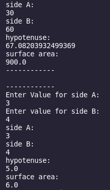

[Back to Portfolio](./)

Right Triangle Calculator
===============

-   **Class: CSCI 301** 
-   **Grade: A**
-   **Language(s): Python**
-   **Source Code Repository:** [neidlinger/rightTriangle](https://guides.github.com/neidlinger/rightTriangle/)  
    (Please [email me](mailto:lgneidlinger@csustudent.net?subject=GitHub%20Access) to request access.)

## Project description

This project took side A and side B of a right triangle from the user. Then, using Pythagoreans' theorem
it calculates the hypotenuse and also calculates the surface area. 

## How to compiles / run the program

Navigate to the correct directory and compile and run using this command:

```bash
python rightTriangle.py
```

## Design

When the program first runs it outputs the calculations based on a pre-determined side A and side B.
From there it asks the user to input their desired side A and then it asks for their side B. Listed out
after the inputs is the calculated hypotenuse and surface area for the respective right triangle. 



Fig 1. Program running with test input


Fig 2. Program running with test input


Fig 3. Program running with test input

[Back to Portfolio](./)